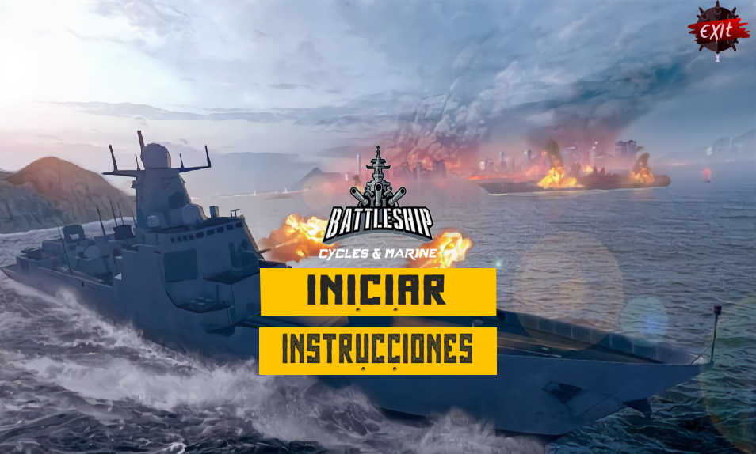
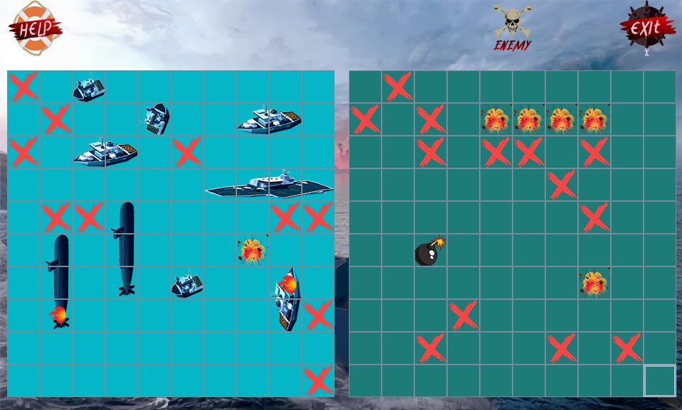

 <h1>🚢 Battleship</h1>
 
A classic naval combat strategy game implemented in Java

## ✨ Features

- Single player gameplay against AI opponent
- Interactive ship placement system
- Real-time battle visualization
- Strategic shooting mechanics

## 🛠️ Built With

- Java
- Swing GUI Framework

## 🎮 Preview

  
  

  
  

## 🤝 Contributors

<table>
 <tr>
   <td align="center">
     <a href="[mailto:borja.carlos@correounivalle.edu.c](https://github.com/anvorja">
       anvorja
     </a>
   </td>
   <td align="center">
     <a href="https://github.com/Deisy05">
       Deisy05
     </a>
   </td>
 </tr>
</table>

